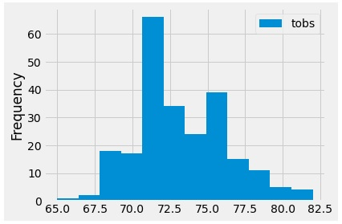
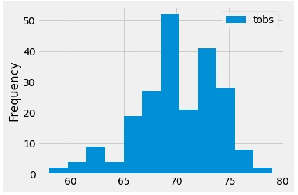

# Surfs Up !!
W. Avy wants to setup an ice cream shop somewhere in Oahu, HI. Using data gathered from different recording stations around Hawaii. Using this information W. Avy can determine if the new enterprise will succeed or fail. 

# Results:
The weather ranges in Oahu, HI are tropical and have small swings (mean June temps of 74.94F and Dec temps of 71.04F) between the months for Summer and Winter. This allows a fairly even tempurates across the entire year. Opening up a business that is relelatant on the outside tempatures to stay above a specific range and possiblay near a sunny area can ensure an even flow of customers no matter the time of year. 

- 1700 observatiosn of tempuatre were collected in June and 1517 oberservations were collected in December bewteeen 9 different stations located throughout the Islands. 
- The most oberservatiosn were collected at station ID USC00519281, located in Waihee, HI (2772). This allows for a further deep dive into an exspected weather pattern (see below.) 
- The location with the fewest observations was in Wahiawa, HI with 511. 

Summary:
Below are two different histograms which detail the tempures using 12 bins (1 for each "month") 
- June had over 60+ observatiosn of the tempuature of ~71F 

 

- December had over 50 oberservatiosn of the tempuares around 68F

 
